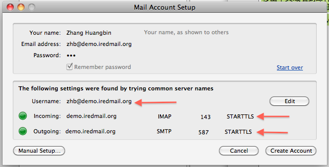
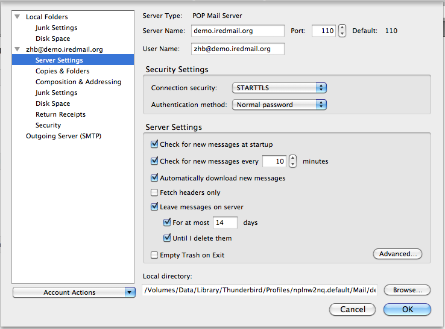
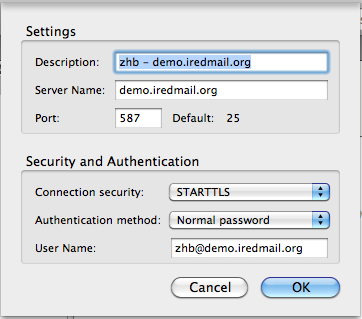

<http://www.iredmail.org/wiki/index.php?title=IRedMail/FAQ/EndUser/Howto.Configure.Thunderbird.for.iRedMail>
#How to configure Microsoft Outlook to use OpenLDAP as global LDAP address book
iRedMail provides POP3, POP3S (pop3 over TLS), IMAP, IMAPS (imap over TLS), SMTP, SMTPS (smtp over TLS) for receiving and sending emails by default.

##Create new mail account
Menu: File -> New -> Mail Account.

Add your name, email address and password in this screen.

[[File:Thunderbird.new.mail.account.png]]

Click continue, it will detect IMAP and SMTP server automatically.

Note:
* You should click "Edit" to input full email address as username.
* If you want to use POP3 instead of IMAP, click "Edit" and change it to POP3 in this screen with port 110, STARTTLS.

##Configure Thunderbird as POP3 client
Warning: Make sure you're using full email address as username.

##Configure Thunderbird as IMAP client

Warning: Make sure you're using full email address as username.

##Configure Thunderbird to send mail via SMTP

Menu: Tools -> Account settings... -> Outgoing server (SMTP) -> Choose the server you're using.

Warning: Make sure you're using full email address as username.

##Use OpenLDAP as Global LDAP Address Book

__IMPORTANT NOTE__: Thunderbird won't show you contacts in LDAP address book directly, but it works when you starting typing email address in recipient field while composing email.

Here we take Thunderbird 5.0 for example. Steps:

* Click __Address Book__ in main window. 
* In Address Book window, click __File -> New -> LDAP Directory__.
* In tab __General__:
** __Name__: use whatever name you like. e.g. Mail Server Address Book.
** __Hostname__: IP address or hostname of your iRedMail server.
** __Base DN__: Base dn of your domain in LDAP directory. Normally, it's __domainName=domain.ltd,o=domains,dc=xxx,dc=xxx__. For example, __domainName=example.com,o=domains,dc=iredmail,dc=org__.
** __Port Number__: 389. Note: If you prefer to connect to OpenLDAP server over SSL, please check the __Use secure connection (SSL)__ in same tab.
** __Bind DN__: It's dn of your mail account. Normally, it's __mail=user@domain.ltd,ou=Users,domainName=domain.ltd,o=domains,dc=xxx,dc=xxx__. For example: __mail=john@example.com,ou=Users,domainName=example.com,o=domains,dc=iredmail,dc=org__.
* In tab __Advanced__:
** __Don't return more than xxx results__: it depends on how many accounts stored in same domain. You can set it to 100, or 1000. 100 is default value in Thunderbird.
** __Scope__: Subtree.
** __Search filter__: (&(enabledService=mail)(enabledService=deliver)(enabledService=displayedInGlobalAddressBook)(|(objectClass=mailList)(objectClass=mailAlias)(objectClass=mailUser)))
** __Login method__: Simple.

* Now switch to tab __Offline__, click button __Download Now__ to test your settings. It will prompt to input password for this LDAP server, just type password of your mail account. With correct __Bind DN__ and password, it will display __Replicated succeeded__.

That's all.
